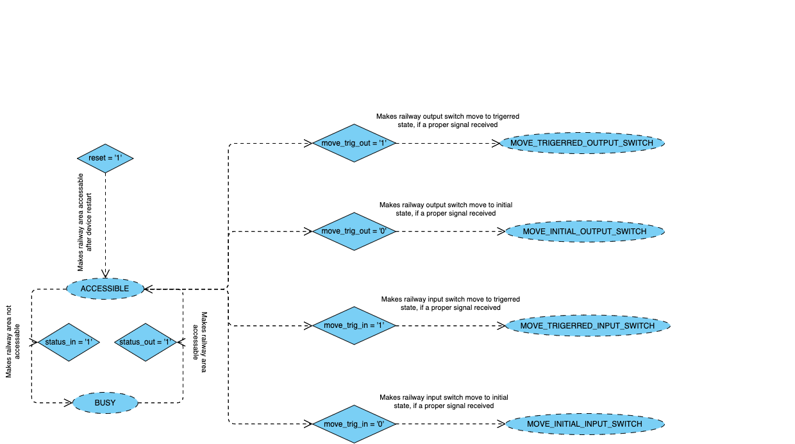

# railroad_switch

## General Information
Example of FSM(Finite-State Machine), which is used to synchronize actions between different devices connected to the standardized hub, used to expose a state of the railroad area status to the other members of the network. 

## Technologies
- Active-HDL(2022)
- VHDL

## Setup
- Open the project workspace with the help of Active-HDL
- Set **railroad_switch_tb** as the main testbench
- Initialize simulation

## Documentation

## Status
This project is stil maintaned

